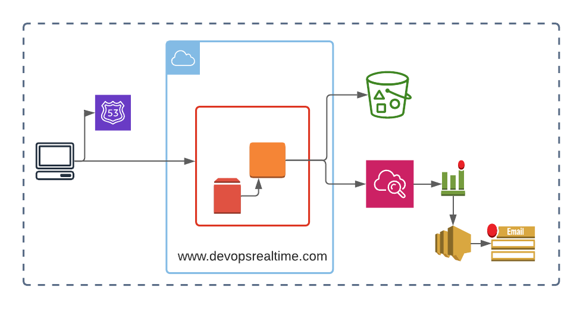

# Deploy HTML-based static web application on AWS EC2

**Task from [devopsrealtime](https://www.devopsrealtime.com/deploy-html-based-static-web-application-on-aws-ec2/)**


## Build image 
1. Setup AWS Credentials:
    a. Provide and export .env file `export $(xargs < .env)`
    b. Setup env variable on your own
2. Validate and build AMI with Packer
```
cd packer/
packer init .
packer validate .
packer build aws-ubuntu.pkr.hcl 
```
3. Deploy infrastructure with Terraform:
```
cd ../terraform
terraform init
terraform plan
terraform apply
```
4. Setup VM with Ansible (don't forget to install boto and boto3):
```
cd ../ansible
ansible-playbook -i inventory.aws_ec2.yml main.yml
```

5. Ensure everything is up and running by checking Public IP Address in AWS Console 

6. Cleanup infrastructure with `cd ../terraform; terraform destroy`